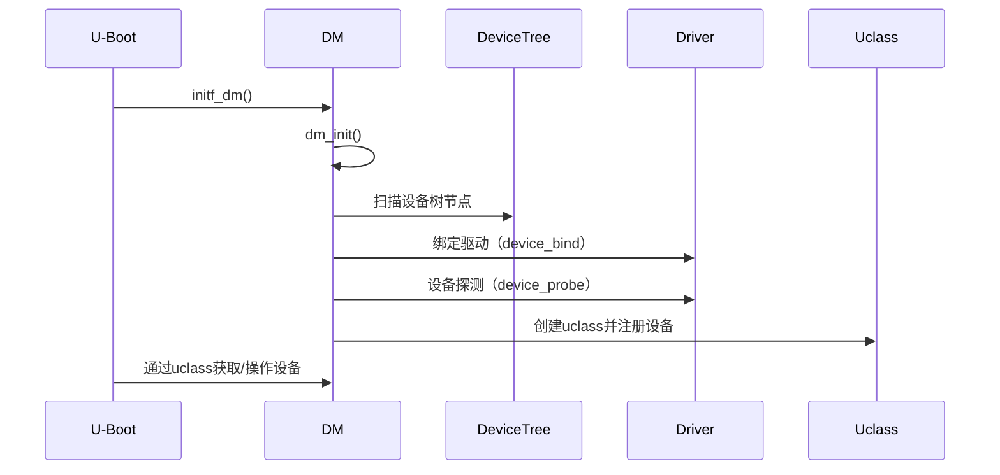

# U-Boot DM（Driver Model）架构详解

## 1. 设计初衷与目标

U-Boot 传统的驱动模型是"板级硬编码"，难以维护和扩展。为了解决多平台、多设备的可移植性和可维护性问题，U-Boot 从 2014 年起引入了 DM（Driver Model，驱动模型）架构，目标是：

- **统一驱动接口**，实现驱动与平台解耦
- **支持设备树**，自动化设备发现与配置
- **便于设备管理**，支持设备的动态注册、绑定、探测、移除
- **提升代码复用性**，减少重复开发

## 2. DM架构核心概念

### 2.1 udevice（设备对象）
- 代表一个具体的硬件设备（如一个I2C控制器、SPI Flash等）
- 结构体：`struct udevice`
- 包含设备状态、父子关系、设备树节点、私有数据等

### 2.2 driver（驱动对象）
- 代表一类硬件的驱动实现
- 结构体：`struct driver`
- 包含驱动名称、所属uclass、probe/remove等回调、操作集（ops）等

### 2.3 uclass（设备类）
- 代表一类设备的抽象（如I2C、SPI、USB、网卡等）
- 结构体：`struct uclass`
- 每个uclass有自己的操作集（ops）和管理方法

### 2.4 platdata（平台数据）
- 用于存储设备的静态配置信息
- 可以来自C代码或设备树

### 2.5 ofnode（设备树节点）
- 代表设备树中的一个节点
- 结构体：`ofnode`
- DM通过ofnode与设备树关联，实现自动化设备发现和配置

## 3. 设备树与DM的关系

- DM支持通过设备树（Device Tree, DT）自动发现和配置设备
- 设备树节点与udevice一一对应
- 设备树属性可自动填充到platdata中
- 通过`compatible`属性实现驱动自动匹配

## 4. 设备注册与驱动绑定流程

1. **设备扫描**
   - 启动时，DM会扫描设备树或静态平台数据，发现所有设备节点
2. **驱动绑定**
   - 根据`compatible`属性，找到合适的driver并与udevice绑定
3. **设备探测（probe）**
   - 调用driver的`probe`回调，完成硬件初始化
4. **设备可用**
   - 设备进入可用状态，供上层调用

### 关键API
- `device_bind()`：绑定设备与驱动
- `device_probe()`：探测设备
- `uclass_get_device()`：获取某类设备
- `uclass_first_device()`/`uclass_next_device()`：遍历同类设备

## 5. 典型调用流程与代码示例

### 5.1 设备注册与探测
```c
struct udevice *dev;
int ret = uclass_get_device_by_name(UCLASS_I2C, "i2c@21a0000", &dev);
if (!ret) {
    // 设备已初始化，可直接操作
}
```

### 5.2 设备树节点与udevice关联
```c
ofnode node = dev_ofnode(dev);
const char *name = ofnode_get_name(node);
```

### 5.3 驱动实现示例
```c
static int my_i2c_probe(struct udevice *dev) {
    // 初始化硬件
    return 0;
}

static const struct udevice_id my_i2c_ids[] = {
    { .compatible = "fsl,imx6ul-i2c" },
    {}
};

U_BOOT_DRIVER(my_i2c) = {
    .name = "my_i2c",
    .id = UCLASS_I2C,
    .of_match = my_i2c_ids,
    .probe = my_i2c_probe,
    // ...
};
```

## 6. DM架构优缺点

### 优点
- 统一驱动接口，便于移植和维护
- 支持设备树，自动化设备发现与配置
- 支持设备的动态注册、移除
- 便于代码复用和模块化

### 缺点
- 初学者理解成本较高
- 某些极简平台可能会增加代码体积
- 旧驱动需迁移到DM架构

## 7. 适用场景
- 推荐所有新平台、新驱动都采用DM架构
- 复杂SoC、需要设备树支持的项目强烈建议使用
- 传统板级硬编码驱动建议逐步迁移到DM

---

**参考资料：**
- [U-Boot官方文档：Driver Model](https://u-boot.readthedocs.io/en/latest/develop/driver-model/index.html)
- U-Boot源码 include/dm.h, drivers/core/

## 8. 典型子系统的DM实现细节

### 8.1 LED 子系统（UCLASS_LED）

- **uclass**：`UCLASS_LED`
- **用途**：统一管理板载/外设LED灯的控制
- **设备树节点**：通常为 `leds` 节点，子节点描述每个LED
- **驱动结构**：
  - 驱动实现 `struct led_ops`，如 `led_set_state()`
  - 通过 `U_BOOT_DRIVER()` 注册
- **典型API**：
  - `led_get_by_label()`：通过label查找LED
  - `led_set_state()`：设置LED状态（开/关/闪烁）
- **代码示例**：
```c
struct udevice *led;
if (!led_get_by_label("status", &led)) {
    led_set_state(led, LEDST_ON);
}
```
- **设备树示例**：
```dts
leds {
    compatible = "gpio-leds";
    status_led: status {
        label = "status";
        gpios = <&gpio1 5 GPIO_ACTIVE_HIGH>;
        default-state = "off";
    };
};
```

### 8.2 I2C 子系统（UCLASS_I2C）

- **uclass**：`UCLASS_I2C`
- **用途**：统一管理I2C控制器和I2C设备
- **设备树节点**：`i2c@xxxx` 控制器节点，子节点为挂载的I2C设备
- **驱动结构**：
  - 控制器驱动实现 `struct dm_i2c_ops`，如 `xfer()`
  - 设备驱动实现 `struct i2c_chip_ops`（如EEPROM、RTC等）
  - 通过 `U_BOOT_DRIVER()` 注册
- **典型API**：
  - `uclass_get_device_by_seq(UCLASS_I2C, bus_num, &dev)`
  - `dm_i2c_probe(dev, chip_addr, ...)`  // 探测I2C从设备
  - `dm_i2c_read()/dm_i2c_write()`
- **代码示例**：
```c
struct udevice *bus;
uclass_get_device_by_seq(UCLASS_I2C, 1, &bus);
dm_i2c_probe(bus, 0x50, 1, &chip);
dm_i2c_read(chip, 0, 1, buf, len);
```
- **设备树示例**：
```dts
i2c1: i2c@21a0000 {
    compatible = "fsl,imx6ul-i2c";
    reg = <0x21a0000 0x4000>;
    #address-cells = <1>;
    #size-cells = <0>;
    status = "okay";
    eeprom@50 {
        compatible = "atmel,24c02";
        reg = <0x50>;
    };
};
```

### 8.3 SPI 子系统（UCLASS_SPI）

- **uclass**：`UCLASS_SPI`
- **用途**：统一管理SPI控制器和SPI设备
- **设备树节点**：`spi@xxxx` 控制器节点，子节点为挂载的SPI设备
- **驱动结构**：
  - 控制器驱动实现 `struct dm_spi_ops`，如 `xfer()`
  - 设备驱动实现 `struct dm_spi_flash_ops`（如SPI Flash）
  - 通过 `U_BOOT_DRIVER()` 注册
- **典型API**：
  - `uclass_get_device_by_seq(UCLASS_SPI, bus_num, &dev)`
  - `dm_spi_claim_bus()/dm_spi_release_bus()`
  - `dm_spi_xfer()`
- **代码示例**：
```c
struct udevice *bus;
uclass_get_device_by_seq(UCLASS_SPI, 0, &bus);
dm_spi_claim_bus(bus);
dm_spi_xfer(bus, bitlen, dout, din, flags);
dm_spi_release_bus(bus);
```
- **设备树示例**：
```dts
spi1: spi@2008000 {
    compatible = "fsl,imx6ul-ecspi";
    reg = <0x2008000 0x4000>;
    #address-cells = <1>;
    #size-cells = <0>;
    status = "okay";
    flash@0 {
        compatible = "jedec,spi-nor";
        reg = <0>;
        spi-max-frequency = <20000000>;
    };
};
```

### 8.4 以太网（网卡）子系统（UCLASS_ETH）

- **uclass**：`UCLASS_ETH`
- **用途**：统一管理以太网MAC控制器和PHY
- **设备树节点**：`ethernet@xxxx`，子节点为PHY
- **驱动结构**：
  - MAC驱动实现 `struct eth_ops`，如 `start()/send()/recv()/stop()`
  - 通过 `U_BOOT_DRIVER()` 注册
- **典型API**：
  - `eth_initialize()`：初始化所有网卡
  - `eth_get_dev_by_name()`：按名称获取设备
  - `eth_send()/eth_recv()`：收发数据包
- **代码示例**：
```c
eth_initialize();
struct udevice *dev;
eth_get_dev_by_name("eth0");
eth_send(dev, buf, len);
eth_recv(dev, buf, len);
```
- **设备树示例**：
```dts
ethernet@2188000 {
    compatible = "fsl,imx6ul-fec";
    reg = <0x2188000 0x4000>;
    phy-handle = <&ethphy0>;
    status = "okay";
};
ethphy0: ethernet-phy@1 {
    reg = <1>;
};
```

---

这些子系统的DM实现都体现了"控制器-设备"分层、设备树自动发现、统一API调用的设计思想。开发新驱动时，建议优先参考对应uclass的头文件和drivers/core/、drivers/子系统目录下的实现。

## 9. DM驱动的使用方法

DM（Driver Model）架构下，驱动的使用方式与传统U-Boot有明显不同，主要体现在"设备自动发现、标准API调用、设备树自动绑定"等方面。

### 9.1 设备获取与探测

- **通过uclass获取设备**：
  - `uclass_get_device()`：按序号/名称/兼容性获取设备
  - `uclass_first_device()`/`uclass_next_device()`：遍历同类设备
- **设备探测（probe）**：
  - 获取到的设备如果尚未初始化，会自动调用驱动的`probe()`方法完成硬件初始化
- **设备树自动绑定**：
  - 只要设备树节点存在且compatible匹配，DM会自动绑定驱动与设备

### 9.2 设备操作的标准API

- 各uclass定义了统一的操作接口（ops），如：
  - I2C：`dm_i2c_read()`、`dm_i2c_write()`
  - SPI：`dm_spi_xfer()`
  - 以太网：`eth_send()`、`eth_recv()`
  - LED：`led_set_state()`
- 通过`udevice`指针调用这些API，无需关心底层驱动细节

### 9.3 典型代码示例

#### 1. I2C 设备操作
```c
#include <i2c.h>
struct udevice *bus;
uclass_get_device_by_seq(UCLASS_I2C, 1, &bus); // 获取I2C1
struct udevice *chip;
dm_i2c_probe(bus, 0x50, 1, &chip);           // 探测I2C从设备
u8 buf[8];
dm_i2c_read(chip, 0, 1, buf, 8);            // 读数据
```

#### 2. SPI 设备操作
```c
#include <spi.h>
struct udevice *bus;
uclass_get_device_by_seq(UCLASS_SPI, 0, &bus);
dm_spi_claim_bus(bus);
dm_spi_xfer(bus, 8, dout, din, SPI_XFER_BEGIN | SPI_XFER_END);
dm_spi_release_bus(bus);
```

#### 3. 以太网设备操作
```c
#include <net.h>
eth_initialize();
struct udevice *dev = eth_get_dev_by_name("eth0");
eth_send(dev, buf, len);
eth_recv(dev, buf, len);
```

#### 4. LED 设备操作
```c
#include <led.h>
struct udevice *led;
if (!led_get_by_label("status", &led)) {
    led_set_state(led, LEDST_ON);
}
```

### 9.4 设备树与自动绑定

- 只需在设备树中正确描述硬件节点（如i2c@xxxx、spi@xxxx、ethernet@xxxx、leds等），并保证compatible属性与驱动匹配，DM会自动完成设备与驱动的绑定和初始化。
- 用户代码无需手动注册设备，只需通过uclass和API获取和操作。

### 9.5 常见问题与调试建议

- **设备未找到/未初始化？**
  - 检查设备树节点和compatible属性是否正确
  - 检查驱动是否正确注册（U_BOOT_DRIVER）
  - 使用`dm tree`命令查看设备树和驱动绑定情况
- **API调用失败？**
  - 检查probe是否成功，返回值是否为0
  - 检查硬件连接和电源
- **调试命令**：
  - `dm tree`：显示所有已注册的DM设备
  - `dm uclass`：显示所有uclass及其设备

---

**小结：**
在DM架构下，驱动的使用变得高度标准化和自动化。开发者只需通过uclass和标准API获取和操作设备，无需关心底层驱动细节和注册流程，大大提升了代码的可维护性和可移植性。

## 10. DM架构的初始化与运行流程

### 10.1 初始化时序（启动阶段）

U-Boot 启动时，DM（Driver Model）初始化主要在 `board_init_f` 阶段完成，关键流程如下：

1. **调用入口**
   - 在 `init_sequence_f` 数组中，`initf_dm()` 负责初始化 DM。
   - 其核心实现为 `dm_init_and_scan(pre_reloc_only)`。

2. **dm_init_and_scan 流程**
   - `dm_init()`：初始化 DM 核心结构，包括 uclass 列表、根设备等。
   - `dm_scan()`：扫描并绑定所有可用设备（来自设备树或平台数据）。
     - `dm_scan_plat()`：扫描静态平台数据（如 U_BOOT_DRVINFO）。
     - `dm_scan_fdt()`/`dm_extended_scan()`：扫描设备树节点，自动绑定驱动。
     - `dm_scan_other()`：板级自定义设备扫描（可选）。
   - `dm_probe_devices()`：递归调用 `device_probe()`，完成设备的硬件初始化。

3. **设备与驱动的绑定和探测**
   - 设备树节点或平台数据被扫描到后，调用 `device_bind()` 绑定到合适的驱动（通过 compatible 匹配）。
   - 绑定后，调用 `device_probe()` 完成硬件初始化，分配私有数据、映射寄存器等。

4. **uclass 初始化**
   - 每个 uclass（如 I2C、SPI、ETH、VIDEO 等）在首次用到时自动创建（`uclass_get()`）。
   - uclass 负责统一管理同类设备，提供标准 API。

#### 时序图（简化）



---

### 10.2 运行时设备管理与API调用

- **设备获取**
  通过 uclass 提供的 API 获取设备实例（如 `uclass_get_device()`、`uclass_first_device()`）。
- **自动探测**
  获取设备时，若未初始化，会自动调用对应驱动的 `probe()` 完成初始化。
- **统一操作接口**
  各 uclass 定义统一的 ops（操作集），如 I2C/SPI/ETH/LED/VIDEO 等，用户通过 `udevice` 指针和标准 API 操作设备，无需关心底层实现。
- **设备树热插拔与动态管理**
  支持设备的动态注册、移除、重绑定等操作，便于扩展和维护。

---

### 10.3 关键数据结构与API

- `struct udevice`：设备对象，保存设备状态、父子关系、设备树节点、私有数据等。
- `struct driver`：驱动对象，描述驱动名称、所属 uclass、probe/remove/bind 等回调。
- `struct uclass`：设备类，统一管理同类设备，定义标准操作集。
- 关键API：
  - `dm_init_and_scan()`：初始化并扫描所有设备
  - `device_bind()`：绑定设备与驱动
  - `device_probe()`：探测并初始化设备
  - `uclass_get_device()`：获取某类设备
  - `uclass_probe_all()`：探测并初始化某类所有设备

---

### 10.4 典型流程代码示例

```c
// 初始化DM（在启动流程中自动完成）
initf_dm(); // -> dm_init_and_scan()

// 获取I2C控制器并操作
struct udevice *i2c_bus;
uclass_get_device_by_seq(UCLASS_I2C, 1, &i2c_bus);
struct udevice *chip;
dm_i2c_probe(i2c_bus, 0x50, 1, &chip);
dm_i2c_read(chip, 0, 1, buf, len);
```

---

### 10.5 总结

- DM初始化在U-Boot早期完成，自动扫描设备树/平台数据，绑定驱动并初始化硬件。
- 运行时通过uclass和标准API统一管理和操作设备，极大提升了可维护性和可扩展性。
- 支持设备的动态注册、移除和热插拔，便于复杂系统的开发和维护。

---
